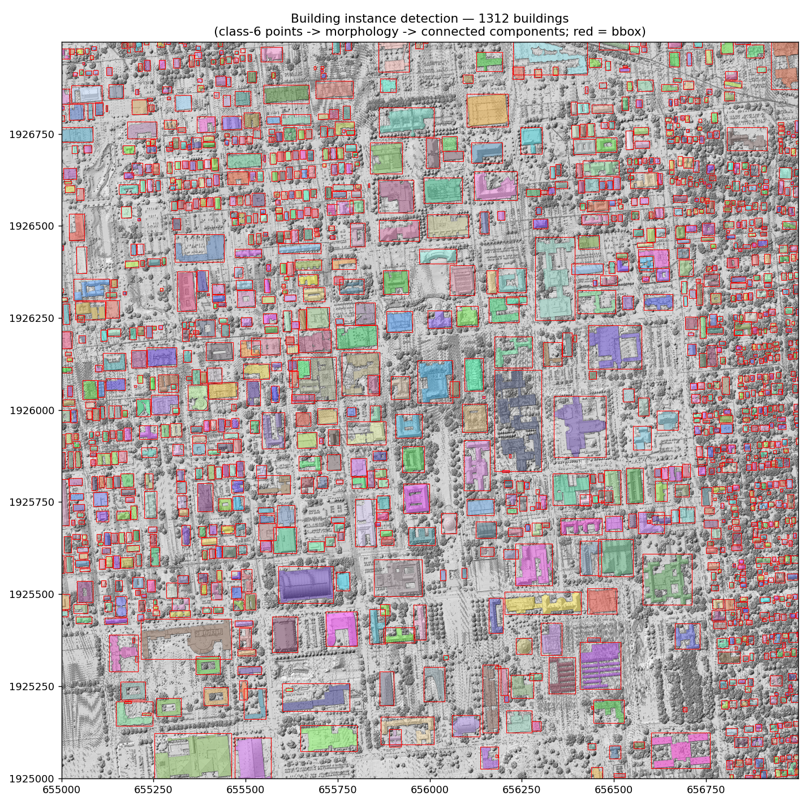
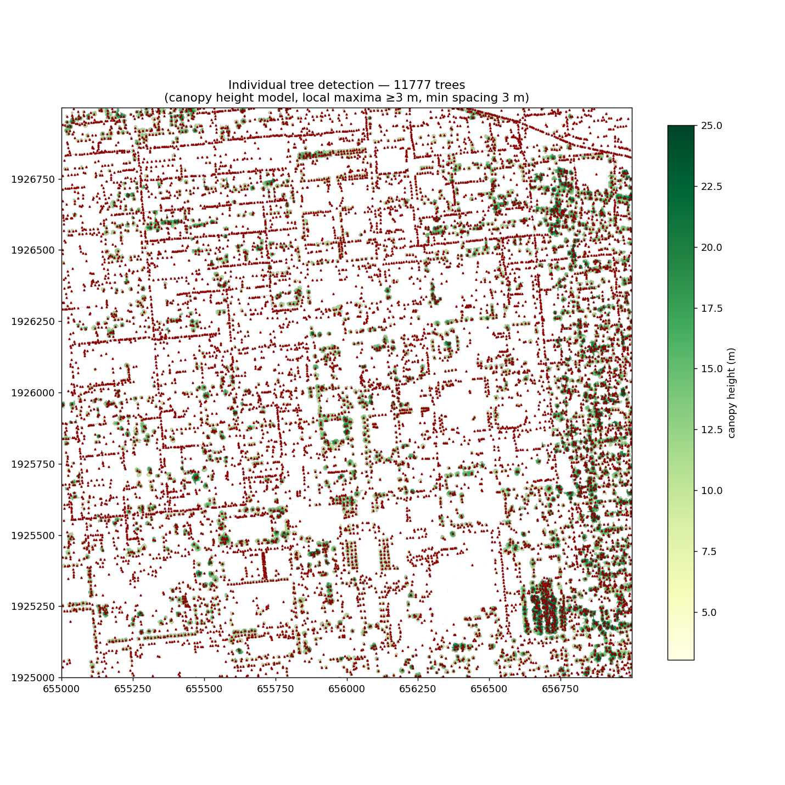
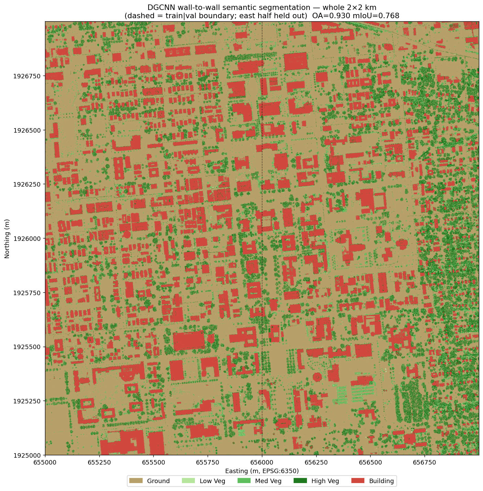
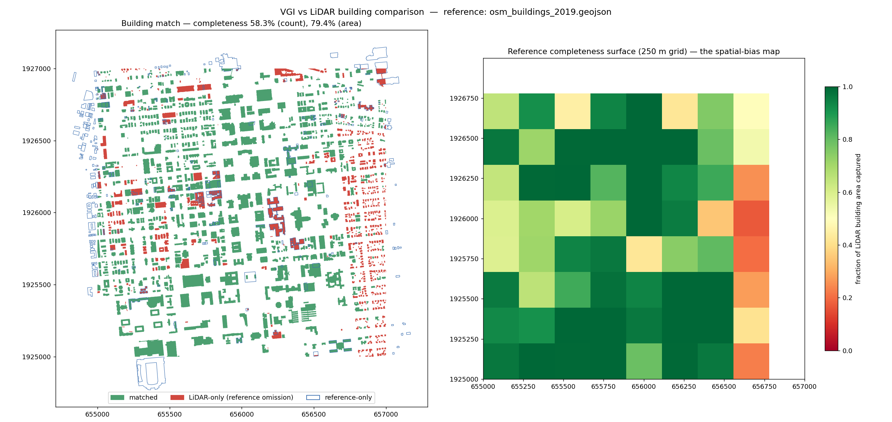
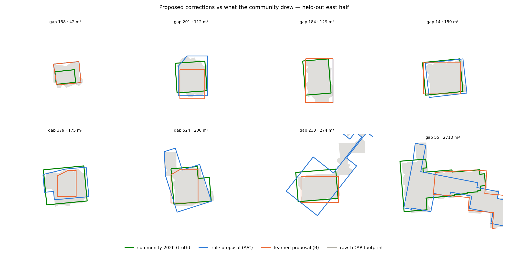
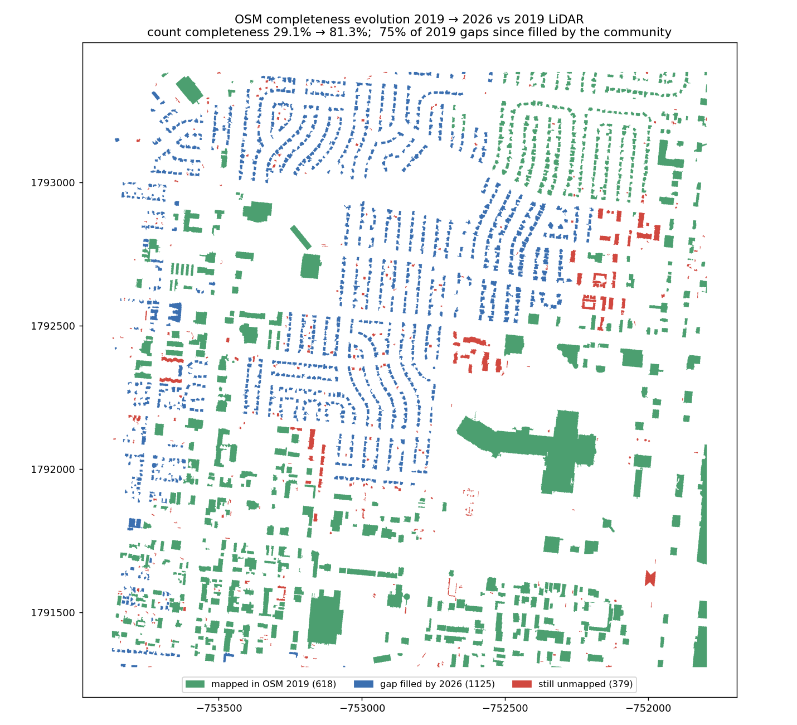

# Detecting and Correcting Spatial Bias in VGI Using Remote Sensing

Volunteered Geographic Information (VGI) such as OpenStreetMap is highly accurate where
many people map and stale where few do. This project builds an end-to-end,
fully reproducible pipeline that **detects** that bias with multimodal remote sensing
(LiDAR + aerial imagery), **quantifies** it up to all 102 Illinois counties, and
**corrects** it — machine-proposing fixes validated against what the OSM community
itself later mapped. Two study regions anchor the method:

| Study region | Tile | LiDAR | OSM 2019 completeness |
|---|---|---|---|
| **UIUC campus** (Urbana, IL) | 2 × 2 km | QL1, ~20 pts/m², fully classified | 58.3% count / 79.4% area |
| **Colorado Springs** (CO) | 2 × 2 km | ~5 pts/m², ground-only classes | **29.1% count / 67.6% area** |

▶ **Run everything**: [`VGI_Spatial_Bias_Pipeline.ipynb`](VGI_Spatial_Bias_Pipeline.ipynb)
— one notebook, all stages, pre-executed with figures, runs unmodified on the
[I-GUIDE JupyterHub](https://platform.i-guide.io).
An [I-GUIDE Summer School 2026 project](https://i-guide.io/summer-school/summer-school-2026/summer-school-2026-projects/).
Framing: [PROJECT_DESCRIPTION](docs/PROJECT_DESCRIPTION.md) ·
[METHODOLOGY](docs/METHODOLOGY.md) · [METRICS](docs/METRICS.md).

## The pipeline

```
 LiDAR (USGS 3DEP) ──► 1 RS reference     buildings · trees · DTM (+ DGCNN segmentation)
 NAIP (RGBN)       ──► 2 optical check    land cover · paved layer (LiDAR-fused)
 OSM 2019 vs RS    ──► 3 detect           building omissions · road support · bias maps
 OSM 2026          ──► 4 validate         did the community confirm our detections?
 statewide + Census──► 5 scale            urban→rural quality gradient, 102 counties
 all of the above  ──► 6 correct          propose → score → prioritize fixes
 second region     ──► 7 generalize       repeat 1–4 on Colorado Springs, no retuning
```

**Key findings at a glance**

| # | Finding | Evidence |
|---|---|---|
| 1 | OSM omissions are real and spatially structured | 58.3% building completeness; < 0.3 on the residential strip |
| 2 | Remote sensing sees them years early | 64% of 2019 gaps community-filled by 2026 |
| 3 | Roads: geometry fine, attributes poor | 91–99.6% pavement support vs 3.3% maxspeed tagged statewide |
| 4 | Quality follows contributors, not need | edit recency ρ = 0.70 with pop. density; downstate frozen at 2008 (TIGER) |
| 5 | Correction works — and hybrid wins | proposal median IoU 0.68; learned scorer precision@50 = 0.84 (base 0.65) |
| 6 | The method generalizes | Colorado Springs, ground-only LiDAR: 74.8% of detected gaps community-confirmed |

---

## 1 · Remote-sensing reference (campus tile)

A reproducible pipeline over a merged 2 × 2 km USGS 3DEP QL1 point cloud (80.8 M
points): classical detection (ground/DTM, building instances, individual trees) plus
DGCNN semantic segmentation of the ASPRS classes (PointNet OA 0.913/mIoU 0.707 →
**DGCNN 0.930/0.768**, spatial train/val split). NAIP adds the independent optical
view; since optical imagery has no height, buildings and pavement are separated by
fusing with the LiDAR footprints — the paved layer becomes the road reference.

| | |
|---|---|
|  |  |
| **1,312 building instances** (footprint + height) | **11,777 individual trees** (height + crown) |
|  |  |
| **DGCNN** segmentation, OA 0.930 · mIoU 0.768 | **NAIP** land cover, LiDAR-fused |

## 2 · Detecting building omissions (OSM 2019 vs RS consensus)

LiDAR footprints (corroborated by NAIP) are ground truth; the temporally matched
OSM 2019 `building=*` snapshot is evaluated via IoU matching → completeness →
gridded bias map:



| completeness (count) | completeness (area) | OSM commission | pixel IoU (0.2 m) | Cohen κ |
|---|---|---|---|---|
| **58.3%** | **79.4%** | 29.5% | 0.698 | 0.774 |

OSM captures the large institutional buildings (79% by area) but misses 547 small
structures, and completeness collapses **below 0.3 on the eastern residential
strip** — a sharp bias gradient inside one tile.

**Temporal validation.** Against OSM 2026 the completeness rises to 81.9%/91.8%:
**the community itself filled 64% of our detected gaps (352/547)** — they were real
omissions, present in the 2019 LiDAR all along. Remote sensing saw in 2019 what took
volunteers seven more years. The 352 confirmations become free ground truth for the
correction stage; the 195 still-unmapped become its deployment targets.

## 3 · Roads (OSM vs the NAIP paved layer)

91% of OSM 2019 way length has pavement evidence — roads were already well-mapped
where buildings were not — and the vetted major-roads subset is **99.6% supported**
(the all-class shortfall is canopy-shaded footways/steps). The 2019→2026 additions
are micro-mapping (+60% segments, +8% length) and **80% of added length was already
paved in 2019**: gap-fill again. Details and caveats:
[results/uiuc_campus/comparison/](results/uiuc_campus/comparison/README.md).

## 4 · Statewide scaling — the urban→rural gradient

The same snapshot scaled to **375,754 major-road segments (235,064 km) across all
102 Illinois counties**, normalized with Census 2019 data:


| metric | ρ vs pop. density | urban mean | rural mean | campus tile |
|---|---|---|---|---|
| % maxspeed tagged | **0.50** | 3.1 | 1.2 | **26.0** |
| % surface tagged | **0.60** | 2.5 | 1.6 | **37.7** |
| % edited 2017+ | **0.70** | 29.9 | 9.3 | **94.2** |
| road density (km/km²) | **0.71** | 3.60 | 1.31 | — |

(all p < 0.001; urban = ≥ 100 persons/km²)

**(1)** Attribute completeness and edit recency are strongly urban-biased — several
downstate counties have a median last edit of **2008** (untouched since the TIGER
import) while Cook/DuPage/Will sit at 2016 and the campus tile at 2018.
**(2)** Geometric supply is near-complete everywhere (km per 1,000 residents is
*higher* rurally, ρ = −0.97): in the US, **bias lives in attributes and currency,
not in whether the line exists**. **(3)** The gradient is not smooth — Sangamon
County is a single-contributor hotspot (33.9% maxspeed, 3–10× any other county).
Write-up: [results/statewide_il/](results/statewide_il/README.md).

## 5 · Correcting the bias (propose → score → prioritize)

Because the community filled 352 of our 547 detections, every machine proposal can be
scored against *what mappers actually drew* — no manual labels. Three approaches,
west-train / east-eval:

| Approach | Geometry | Confidence | median IoU | AUC | precision@50 |
|---|---|---|---|---|---|
| **A** rules | regularized LiDAR footprint | threshold tiers | 0.677 | 0.742 | 0.62 |
| **B** learned | U-Net (NAIP + CHM) | mask probability | 0.589 | 0.695 | 0.66 |
| **C** hybrid ⭐ | same as A | GBM acceptance scorer | 0.677 | 0.738 | **0.84** |



With only 83 training gaps, **rules beat learning for geometry** (the raw LiDAR
footprint is itself the best overlap at 0.691 — regularization trades a little IoU
for OSM-style right angles). But the **learned scorer wins the human-review queue**:
84% of its top-50 proposals were later confirmed by the community (base rate 65%).
Proposals carry OSM-ready tags (`building=yes`, `height=*`) yet remain research
artifacts per the OSM Automated Edits Code of Conduct: the 195 outstanding proposals
are ranked for human review (`results/uiuc_campus/correction/deployment_map.png`), and a
statewide **staleness × population-exposure** map points the pipeline at Cook, Lake
and Winnebago first (`results/statewide_il/deploy_priority.png`).

## 6 · Generalization — the Colorado Springs region

The whole detect → validate loop repeats on a **2 × 2 km Colorado Springs
residential tile** with deliberately harder inputs: ~5 pts/m² LiDAR carrying only
ground/non-ground classes (no ASPRS building/vegetation), in a semi-arid landscape.
`src/region_detection.py` replaces the missing class evidence with **NAIP NDVI +
the multi-return echo fraction** while keeping the identical grid, morphology and
thresholds — 2,122 buildings detected:



| | UIUC campus | Colorado Springs |
|---|---|---|
| OSM 2019 completeness (count / area) | 58.3% / 79.4% | **29.1% / 67.6%** |
| gaps community-filled by 2026 | 64% | **74.8%** |
| completeness today | 81.9% / 91.8% | 81.3% / 91.9% |
| road length NAIP-supported | 99.6% (major) | 99.9% |

The residential tile was under-mapped **twice as badly** as the campus in 2019 —
entire subdivisions were absent — and the community has since independently
confirmed three quarters of our detections. Road geometry is near-perfect in both
regions: across two very different landscapes, the bias lives in buildings and
attributes, not the road network. (Semi-arid caveat: dry ground depresses NDVI and
inflates the NAIP impervious class, so the *reverse* explained-paved metric is not
comparable across regions; forward road support is unaffected.)

---

## Quick start

```bash
pip install -r requirements.txt
jupyter lab VGI_Spatial_Bias_Pipeline.ipynb   # end-to-end: downloads all data, runs every stage
```

Or run the scripts directly (in order — later stages reuse earlier outputs):

```bash
python src/prepare_data.py           # fetch LiDAR + NAIP + statewide inputs (idempotent)
python src/classical_detection.py    # ground/DTM, buildings, trees   -> results/uiuc_campus/detection/
python src/dgcnn_semseg.py           # semantic segmentation          -> results/uiuc_campus/segmentation/
python src/naip_segmentation.py data/uiuc_campus/NAIP_image.tif            # land cover -> results/uiuc_campus/naip/
python src/vgi_comparison.py data/uiuc_campus/osm_buildings_2019.geojson   # bias map -> results/uiuc_campus/comparison/
python src/statewide_bias.py data/statewide_il/OSM_2019_Major_Roads/gis_osm_roads_2019_IL_Major_Roads.shp \
       data/statewide_il results/statewide_il                        # county gradient
python src/propose_geometry.py && python src/acceptance_scorer.py && \
       python src/propose_learned.py && python src/correction_benchmark.py && \
       python src/deploy_priority.py                           # correction -> results/uiuc_campus/correction/
# second region (Colorado Springs) — same pipeline, explicit region paths:
python src/prepare_data.py colorado
python src/region_detection.py data/colorado_springs/cs_lidar_2km.laz \
       data/colorado_springs/naip_cs_6350.tif results/colorado_springs/detection
python src/vgi_comparison.py data/colorado_springs/osm_buildings_2019_cs.geojson \
       results/colorado_springs/comparison results/colorado_springs/detection/buildings.geojson
```

Device auto-selects CUDA → Apple MPS → CPU; a full campus run takes ≈ 15–25 min
(DGCNN and the correction U-Net are optional flags in the notebook).

### Running on the I-GUIDE platform

The notebook's bootstrap cell clones this repository automatically when opened
standalone, and `src/prepare_data.py` fetches all inputs from public storage. Two
platform specifics:

- **Old geospatial stack.** The CyberGISX kernel ships Python 3.8, which caps
  geopandas at ≤ 0.13. The pipeline supports both generations (`union_all` →
  `unary_union` fallback, `read_file(columns=…)` fallback). A geopandas
  `AttributeError`/`TypeError` is almost certainly this version skew — please open
  an issue.
- **Updating an existing clone.** The bootstrap cell clones only when the repo is
  missing; pick up fixes with `!git -C ~/vgi-spatial-bias pull`, then re-run the
  failed cell (every step is idempotent).

## Repository layout

Everything is organized by study region — `data/` and `results/` mirror each other:

```
VGI_Spatial_Bias_Pipeline.ipynb    end-to-end reproducible notebook (all stages, I-GUIDE-ready)
src/                               pipeline scripts (region-agnostic; defaults = UIUC campus)
  prepare_data.py                    fetch every external input (lidar|naip|statewide|colorado)
  classical_detection.py             UIUC detection (uses ASPRS classes)
  region_detection.py                detection for minimally-classified LiDAR (NDVI+echo)
  dgcnn_semseg.py · pointnet_semseg.py   deep-learning segmentation
  naip_segmentation.py               optical land cover + paved layer
  vgi_comparison.py · pixel_comparison.py · temporal_validation.py    buildings
  road_comparison.py · road_evolution.py · major_roads_analysis.py    roads
  statewide_bias.py                  102-county gradient
  propose_geometry.py · propose_learned.py · acceptance_scorer.py
  correction_benchmark.py · deploy_priority.py                        correction
data/
  uiuc_campus/                     OSM 2019/2026 subsets · metadata · [LiDAR/NAIP, fetched]
  colorado_springs/                boundary · OSM 2019/2026 clips · [LiDAR/NAIP, fetched]
  statewide_il/                    [statewide OSM + Census files, fetched]
docs/                              PROJECT_DESCRIPTION · METHODOLOGY · METRICS · design specs
results/
  uiuc_campus/                     detection/ · segmentation/ · naip/ · comparison/ · correction/
  colorado_springs/                detection/ · naip/ · comparison/
  statewide_il/                    county gradient + deployment priority
```

Bracketed items are heavy inputs: gitignored locally, hosted on the GitHub releases /
I-GUIDE storage, and staged by `python src/prepare_data.py` (idempotent).

## Data sources

- **LiDAR** — USGS 3DEP `IL_8County_PlusChampaign_2019_B19` (QL1), EPSG:6350/NAVD88,
  via [I-GUIDE storage](https://storage.i-guide.io).
- **NAIP** — 4-band aerial imagery, ~0.7 m, on the
  [`campus-rs-2019` release](https://github.com/rayford295/vgi-spatial-bias/releases/tag/campus-rs-2019).
- **OSM 2019** — Illinois statewide extracts (1.20 M buildings, 765 K roads, plus the
  county-joined major-roads file) on the
  [`osm-il-2019` release](https://github.com/rayford295/vgi-spatial-bias/releases/tag/osm-il-2019);
  OSM 2026 snapshots committed in `data/`. © OpenStreetMap contributors (ODbL).
- **Census 2019** — county land area, population estimates and cartographic
  boundaries (public census.gov static files).
- **Colorado Springs** — merged LiDAR (LAZ), clipped + original NAIP, and the full
  source bundle (raw tiles + statewide Colorado OSM extracts) on the
  [`colorado-springs-2019` release](https://github.com/rayford295/vgi-spatial-bias/releases/tag/colorado-springs-2019).

## License

MIT for code (see [LICENSE](LICENSE)); USGS 3DEP LiDAR and USDA NAIP are public
domain; OSM data is ODbL.
