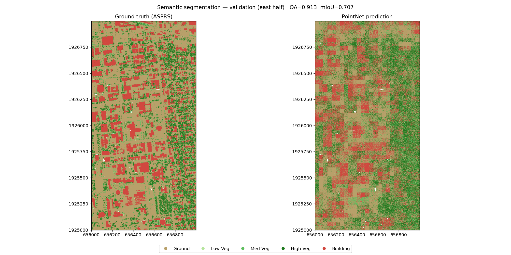
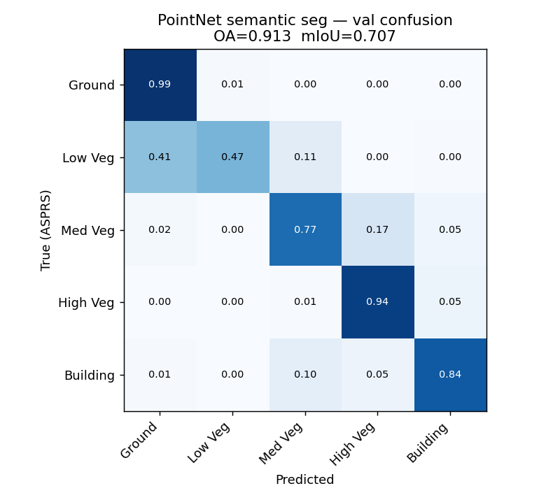

# UIUC Campus LiDAR — Detection & Segmentation

End-to-end, reproducible LiDAR analysis of the University of Illinois Urbana-Champaign
campus: a merged 2 × 2 km USGS 3DEP QL1 point cloud (80.8 M points) processed into
**building instances**, **individual trees**, a **bare-earth terrain model**, and a
**deep-learning semantic segmentation** of the ASPRS classes.

The [notebook](UIUC_campus_LiDAR_pipeline.ipynb) is fully self-contained — it downloads
the point cloud from I-GUIDE storage and runs everything top to bottom.

## Results

| | |
|---|---|
|  |  |
| **1,312 building instances** (footprint + height) | **11,777 individual trees** (height + crown) |
|  |  |
| PointNet semantic segmentation (val = east half) | **OA 0.913 · mIoU 0.707** |

Per-class IoU: Ground 0.96 · High Veg 0.85 · Building 0.78 · Med Veg 0.57 · Low Veg 0.39.

## Data

- **Source:** USGS 3DEP Lidar Point Cloud, `IL_8County_PlusChampaign_2019_B19` (QL1), 4 × 1 km tiles.
- **CRS:** NAD83(2011) / Conus Albers metres (EPSG:6350); vertical NAVD88 Geoid12B (EPSG:5703).
- **Extent (WGS84):** `-88.2402753, 40.0990944, -88.2147506, 40.1183436` (centre ≈ UIUC Main Quad).
- The point cloud is **not** in this repo (336 MB); the notebook fetches it from I-GUIDE.

## Run it

```bash
pip install -r requirements.txt
jupyter lab UIUC_campus_LiDAR_pipeline.ipynb   # run all cells
```

Or the scripts directly (expect the `.laz` in this folder):

```bash
python detect_classical.py     # ground/DTM, buildings, trees  -> results/
python dl_semseg.py            # PointNet semantic segmentation -> results/
```

Device is auto-selected **CUDA → Apple MPS → CPU**, so the notebook runs unchanged on a
GPU server or a laptop. Full run ≈ 10–15 min on CPU/MPS.

## Repository layout

```
UIUC_campus_LiDAR_pipeline.ipynb   reproducible end-to-end notebook (download → results)
detect_classical.py                classical instance detection (ground / buildings / trees)
dl_semseg.py                       PointNet semantic segmentation (PyTorch)
requirements.txt
results/
  README.md                        methods & metrics write-up
  buildings.geojson  trees.geojson footprint.geojson   (WGS84, for QGIS / JOSM)
  *_detected.png  dl_*.png                             example figures
  dl_metrics.json  detection_summary.json
  dl_pointnet.pt                   trained model weights
```

## Method (brief)

1. **Merge** — four adjacent tiles concatenated into one gap-free cloud (they share edges exactly).
2. **Rasterize** (0.5 m, single pass) — surface (max-Z, noise removed), terrain (min-Z of ground),
   class counts. `CHM = DSM − DTM` gives height-above-ground.
3. **Buildings** — class-6 raster → morphology → connected components; height from CHM.
4. **Trees** — smoothed-CHM local maxima (≥3 m, 3 m spacing) + watershed crowns.
5. **Semantic segmentation** — block-wise PointNet trained on the ASPRS labels with a
   **spatial** west/east train–val split (no leakage); height-above-ground is the key feature.

## License

Code: [MIT](LICENSE). Input LiDAR data: USGS 3DEP, U.S. public domain.

## Citation

Point cloud derived from *USGS 3DEP Lidar Point Cloud, IL_8County_PlusChampaign_2019_B19*,
U.S. Geological Survey (public domain).
