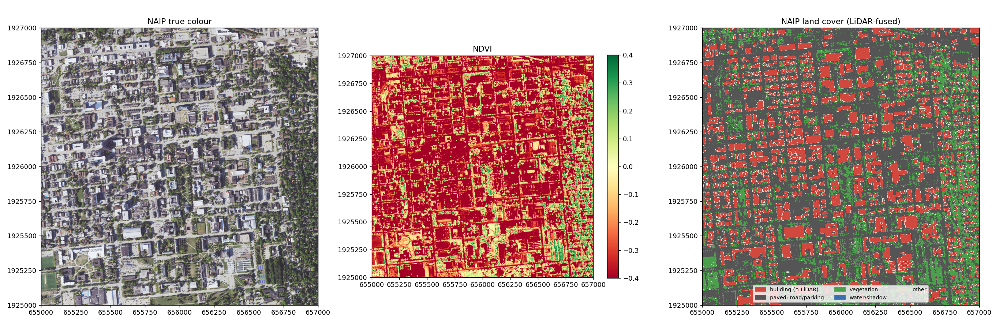
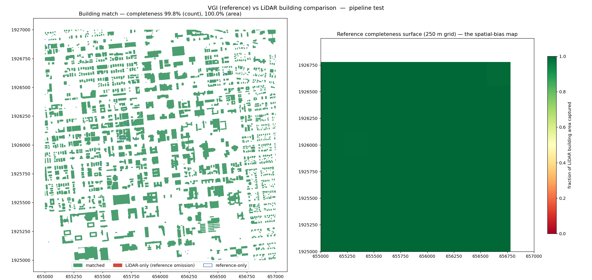
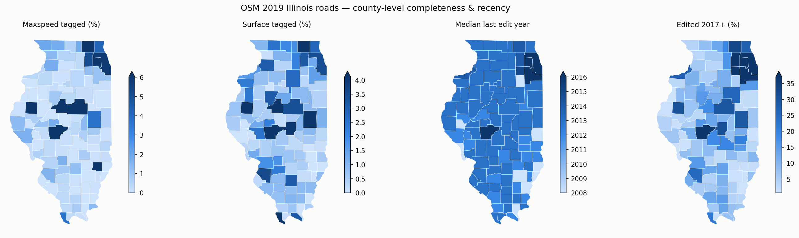
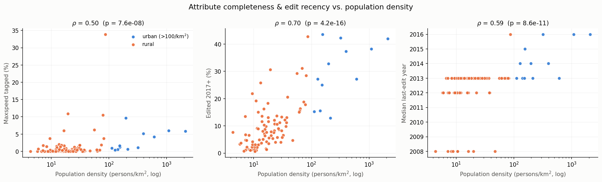

# Detecting and Correcting Spatial Bias in VGI Using Remote Sensing

Volunteered Geographic Information (VGI) such as OpenStreetMap is accurate in well-mapped
urban areas but incomplete in data-sparse regions. This project evaluates and calibrates
VGI using multimodal remote sensing (LiDAR + aerial imagery) at two scales: a 2 × 2 km
UIUC campus pilot with a full RS ground-truth pipeline, and a statewide 102-county
Illinois analysis quantifying the urban→rural bias gradient.

An [I-GUIDE Summer School 2026 project](https://i-guide.io/summer-school/summer-school-2026/summer-school-2026-projects/).
Research questions and full framing: [docs/PROJECT_DESCRIPTION.md](docs/PROJECT_DESCRIPTION.md) ·
comparison design: [docs/METHODOLOGY.md](docs/METHODOLOGY.md) · metrics: [docs/METRICS.md](docs/METRICS.md).

## Results

| | |
|---|---|
|  |  |
| **1,312 building instances** from LiDAR (footprint + height) | **11,777 individual trees** (height + crown) |
|  |  |
| **DGCNN** semantic segmentation, OA 0.930 · mIoU 0.768 | **NAIP** land cover, corroborating RS reference |

The remote-sensing reference comes from a reproducible pipeline over a merged 2 × 2 km
USGS 3DEP QL1 point cloud (80.8 M points): classical detection (buildings, trees, DTM)
plus DGCNN semantic segmentation of the ASPRS classes (PointNet baseline OA 0.913 /
mIoU 0.707 → DGCNN 0.930 / 0.768, spatial train/val split).

## VGI comparison — first result

LiDAR footprints (corroborated by NAIP) are the ground truth; OSM 2019 `building=*`
(temporally matched to the LiDAR) is evaluated against them — IoU matching →
completeness → gridded bias map:

```bash
python src/vgi_comparison.py data/osm_buildings_2019.geojson
```



| completeness (count) | completeness (area) | OSM commission | pixel IoU (0.2 m) | Cohen κ |
|---|---|---|---|---|
| **58.3%** | **79.4%** | 29.5% | 0.698 | 0.774 |

OSM captures the large institutional buildings (hence 79% by area) but misses 547 small
structures, and completeness collapses to **< 0.3 on the eastern residential strip** —
a sharp spatial-bias gradient inside a single 2 × 2 km tile.

**Temporal validation:** against current OSM (2026), completeness rises to 81.9% / 91.8%
— **64% of the 2019 gaps have since been filled by the community**, confirming they were
genuine omissions (the buildings were in the 2019 LiDAR all along), not yet-unbuilt
structures.

**Roads** (vs the NAIP paved layer — LiDAR has no road class): 91% of OSM 2019 way
length has pavement evidence, so roads were already well-mapped where buildings were not;
2026 adds micro-mapping detail (+60% segments, +8% length), and **80% of the added
length was already paved in the 2019 imagery** — filled gaps, mirroring the buildings
story. Unexplained pavement is mostly parking, and canopy-shaded streets are a known
optical false alarm. The vetted major-roads subset
(`data/osm_roads_2019_major.geojson`, 154 segments) is **99.6% supported** — the
all-class shortfall is entirely footways/steps under canopy, so major-way geometry is
sound. Details and caveats: [results/comparison/](results/comparison/README.md).

## Statewide scaling — the urban→rural bias gradient

The same 2019 snapshot, scaled to **375,754 major-road segments (235,064 km) across all
102 Illinois counties** (`src/statewide_bias.py`), tests whether OSM quality varies
systematically with who lives there:




| metric | Spearman ρ vs pop. density | urban mean | rural mean | campus tile |
|---|---|---|---|---|
| % maxspeed tagged | **0.50** | 3.1 | 1.2 | **26.0** |
| % surface tagged | **0.60** | 2.5 | 1.6 | **37.7** |
| % edited 2017+ | **0.70** | 29.9 | 9.3 | **94.2** |
| road density (km/km²) | **0.71** | 3.60 | 1.31 | — |

(all p < 0.001; urban = ≥ 100 persons/km²; campus = the major-roads clip)

Three findings: **(1)** attribute completeness and edit recency are strongly
urban-biased — several downstate counties have a median last-edit year of **2008**,
untouched since the TIGER import, while Cook/DuPage/Will sit at 2016 and the campus
tile at 2018; **(2)** geometric supply is near-complete everywhere (km per 1,000
residents is *higher* in rural counties, ρ = −0.97) — in the US the bias lives in
**attributes and currency, not in whether the line exists**; **(3)** the gradient is
not smooth: Sangamon County (Springfield) is a single-contributor hotspot with 33.9%
maxspeed tagging, 3–10× any other county. Full write-up:
[results/statewide/](results/statewide/README.md).
Statewide OSM extracts (1.20 M buildings, 765 K roads) are on the
[`osm-il-2019` release](https://github.com/rayford295/vgi-spatial-bias/releases/tag/osm-il-2019).

## Quick start

```bash
pip install -r requirements.txt
jupyter lab VGI_Spatial_Bias_Pipeline.ipynb   # end-to-end: downloads all data, runs every stage
```

The notebook covers the **entire pipeline** (LiDAR detection → DGCNN segmentation →
NAIP → buildings/roads VGI comparison → statewide bias) with a documented, explained
step per stage, and runs unmodified on the I-GUIDE JupyterHub. Or run the scripts
directly (in order — later ones reuse earlier outputs):

```bash
python src/prepare_data.py           # fetch LiDAR + NAIP + statewide inputs (idempotent)
python src/classical_detection.py    # ground/DTM, buildings, trees   -> results/detection/
python src/dgcnn_semseg.py           # semantic segmentation          -> results/segmentation/
python src/naip_segmentation.py data/NAIP_image.tif            # land cover -> results/naip/
python src/vgi_comparison.py data/osm_buildings_2019.geojson   # bias map -> results/comparison/
python src/statewide_bias.py data/statewide/OSM_2019_Major_Roads/gis_osm_roads_2019_IL_Major_Roads.shp \
       data/statewide results/statewide                        # county gradient
```

Device auto-selects CUDA → Apple MPS → CPU; a full campus run takes ≈ 10–15 min.

## Repository layout

```
VGI_Spatial_Bias_Pipeline.ipynb    end-to-end reproducible notebook (all stages, I-GUIDE-ready)
src/                               pipeline scripts (detection, segmentation, comparison, NAIP, statewide)
data/                              OSM 2019 campus subsets + CRS/bbox metadata
docs/                              PROJECT_DESCRIPTION · METHODOLOGY · METRICS
results/                           detection/ · segmentation/ · comparison/ · naip/ · statewide/
```

Large / regenerable artifacts (`.laz`, `.tif`, caches) are gitignored — the notebook
downloads the point cloud from I-GUIDE storage and the scripts recreate the rest.

## Data sources

- **LiDAR:** USGS 3DEP `IL_8County_PlusChampaign_2019_B19` (QL1), EPSG:6350 / NAVD88.
- **OSM 2019:** Illinois statewide shapefiles (WGS84), incl. the county-joined major-roads
  extract used by `src/statewide_bias.py` — see the release above.
- **NAIP:** 4-band aerial imagery, ~0.7 m, fused with LiDAR for the impervious/paved layers.
- **Census 2019:** county land area (gazetteer), population (`co-est2019`), and cartographic
  boundaries — normalization covariates for the statewide analysis.

## License

MIT for code (see [LICENSE](LICENSE)); USGS 3DEP data is public domain.
