<div align="center">

# Detecting and Correcting Spatial Bias in VGI Using Remote Sensing

**OpenStreetMap is superb where many people map and stale where few do.**
This repository detects that bias with LiDAR + aerial imagery, quantifies it across all 102 Illinois counties, and corrects it with machine proposals the OSM community itself later confirmed.

[](https://rayford295.github.io/vgi-spatial-bias/)
[](VGI_Spatial_Bias_Pipeline.ipynb)
[](https://platform.i-guide.io/notebooks/43edf307-c6af-4d1f-948b-260a0092a2c0)
[](LICENSE)
[](requirements.txt)
[](#data-sources)

[**Website**](https://rayford295.github.io/vgi-spatial-bias/) ·
[**Run the notebook**](VGI_Spatial_Bias_Pipeline.ipynb) ·
[**Findings**](#key-findings) ·
[**Quick start**](#quick-start) ·
[**Cite**](#citation)

</div>

---

> ### 📺 I-GUIDE Virtual Consulting Office (VCO) talk — **September 23, 2026 · 11:00 am Central Time**
>
> The project team presents this work live in the I-GUIDE VCO webinar series.
>
> **[▶ Register to attend (Zoom)](https://illinois.zoom.us/meeting/register/JkvSicIHQDiJr7Rvl7WuRA)** ·
> [Event page](https://i-guide.io/i-guide-vco/detecting-and-correcting-spatial-bias-in-vgi-using-remote-sensing/)
>
> **Speakers** — Kristina Fillman (Oregon State University) · Nowshin Nawar (University of Arkansas) ·
> Ravi Thapaliya (University of North Carolina at Charlotte) · Yifan Yang (Texas A&M University) ·
> Fangzheng Lyu, team lead (Virginia Tech)
>
> <details><summary><b>Talk abstract</b></summary>
>
> Volunteered Geographic Information (VGI) maps (e.g., OpenStreetMap, Mapillary) are widely used for urban analytics, disaster response, and environmental applications. However, its quality is uneven: while highly accurate in developed urban areas, VGI often suffers from incompleteness and positional errors in rural regions and the Global South due to limited contributions and expert effort in calibration. This spatial bias can introduce uncertainty into downstream analysis, particularly in data-sparse regions. This project, undertaken by Team 1 during I-GUIDE's 2026 Summer School, aimed to develop a systematic approach to evaluate and calibrate VGI maps using multimodal remote sensing data (e.g., Landsat satellite remote sensing imagery and LiDAR remote sensing data). The key research questions were 1) How does VGI accuracy and completeness vary across geographic and socioeconomic contexts? 2) Can remote sensing data detect discrepancies in VGI data such as roads and buildings? 3) How can we develop scalable (AI) approaches to automatically improve VGI quality in data-sparse regions? During the Summer School, the team collaborated to design evaluation metrics and workflows, extract features from imagery and LiDAR, and develop models for detection and calibration. They will describe their scalable workflow for benchmarking and enhancing VGI data quality across diverse geographic contexts.
>
> </details>

---

## At a glance

<table>
<tr>
<td width="50%" valign="top">

**What it does**

1. Builds an objective **remote-sensing reference** from USGS 3DEP LiDAR and NAIP imagery.
2. **Detects** where OpenStreetMap under-maps buildings and roads, and maps the bias.
3. **Validates** every detection against what the OSM community mapped seven years later.
4. **Scales** the analysis to a 102-county urban → rural gradient.
5. **Corrects** the gaps: propose → score → prioritize OSM-ready fixes.
6. **Generalizes** to a second region with harder data and no retuning.

</td>
<td width="50%" valign="top">

**Two study regions**

| | UIUC campus (IL) | Colorado Springs (CO) |
|---|---|---|
| Tile | 2 × 2 km | 2 × 2 km |
| LiDAR | QL1 ~20 pts/m², fully classified | ~5 pts/m², ground-only |
| OSM 2019 completeness | 58.3% count / 79.4% area | **29.1% / 67.6%** |
| Gaps community-filled by 2026 | 64% | **74.8%** |

Everything is reproducible from one notebook that runs unmodified on the [I-GUIDE JupyterHub](https://platform.i-guide.io).

</td>
</tr>
</table>

<p align="center">
  <a href="results/uiuc_campus/comparison/comparison_map.png">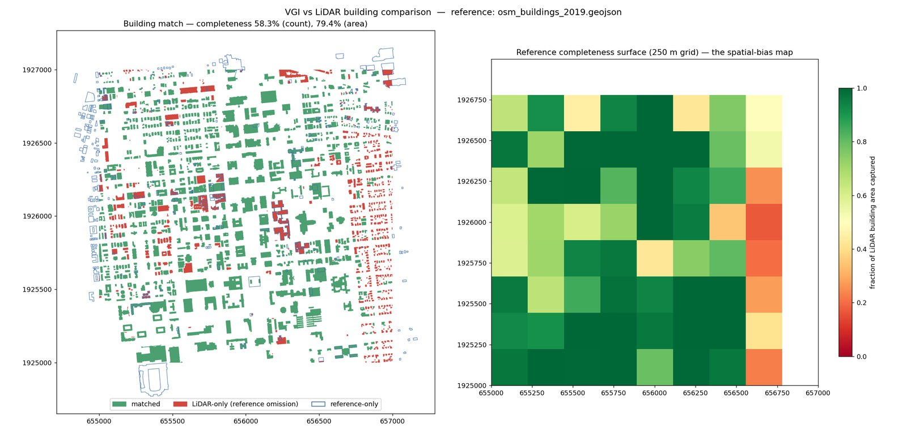</a><br>
  <sub>OSM 2019 versus LiDAR-derived buildings, UIUC campus. Completeness collapses below 0.3 on the eastern residential strip.</sub>
</p>

## Key findings

| # | Finding | Evidence |
|---|---|---|
| 1 | OSM omissions are real and spatially structured | 58.3% building completeness; < 0.3 on the residential strip |
| 2 | Remote sensing sees them years early | 64% of 2019 gaps community-filled by 2026 |
| 3 | Roads: geometry fine, attributes poor | 91–99.6% pavement support vs 3.3% `maxspeed` tagged statewide |
| 4 | Quality follows contributors, not need | edit recency ρ = 0.70 with population density; downstate frozen at 2008 (TIGER) |
| 5 | Correction works, and hybrid wins | proposal median IoU 0.68; learned scorer precision@50 = 0.84 (base 0.65) |
| 6 | The method generalizes | Colorado Springs, ground-only LiDAR: 74.8% of detected gaps community-confirmed |
| 7 | Correction winners flip with label volume | CS (821 labels): U-Net IoU 0.769 > rules; GBM scorer AUC 0.985, P@50 = 1.00 |

## The pipeline

```
 LiDAR (USGS 3DEP) ──► 1 RS reference     buildings · trees · DTM (+ DGCNN segmentation)
 NAIP (RGBN)       ──► 2 optical check    land cover · paved layer (LiDAR-fused)
 OSM 2019 vs RS    ──► 3 detect           building omissions · road support · bias maps
 OSM 2026          ──► 4 validate         did the community confirm our detections?
 statewide + Census──► 5 scale            urban→rural quality gradient, 102 counties
 all of the above  ──► 6 correct          propose → score → prioritize fixes
 second region     ──► 7 generalize       repeat 1–4 on Colorado Springs, no retuning
```

<details open>
<summary><h3>1 · Remote-sensing reference (campus tile)</h3></summary>

A reproducible pipeline over a merged 2 × 2 km USGS 3DEP QL1 point cloud (80.8 M
points): classical detection (ground/DTM, building instances, individual trees) plus
DGCNN semantic segmentation of the ASPRS classes (PointNet OA 0.913 / mIoU 0.707 →
**DGCNN 0.930 / 0.768**, spatial train/val split). NAIP adds the independent optical
view; since optical imagery has no height, buildings and pavement are separated by
fusing with the LiDAR footprints. The paved layer becomes the road reference.

| | |
|---|---|
| <a href="results/uiuc_campus/detection/buildings_detected.png">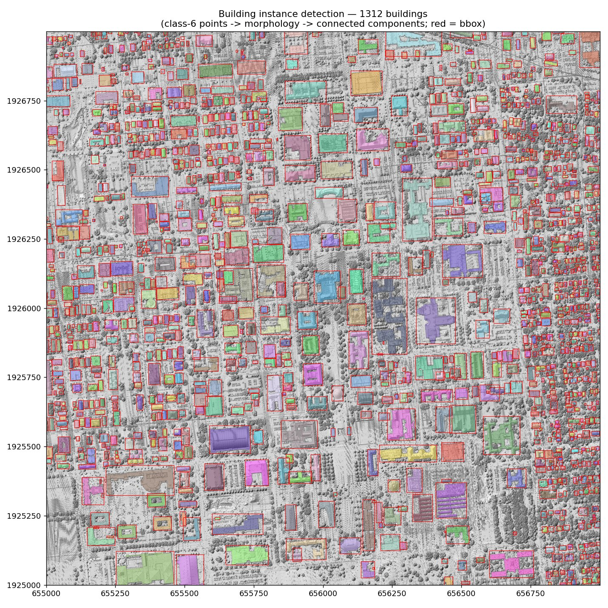</a> | <a href="results/uiuc_campus/segmentation/seg_fulltile.png">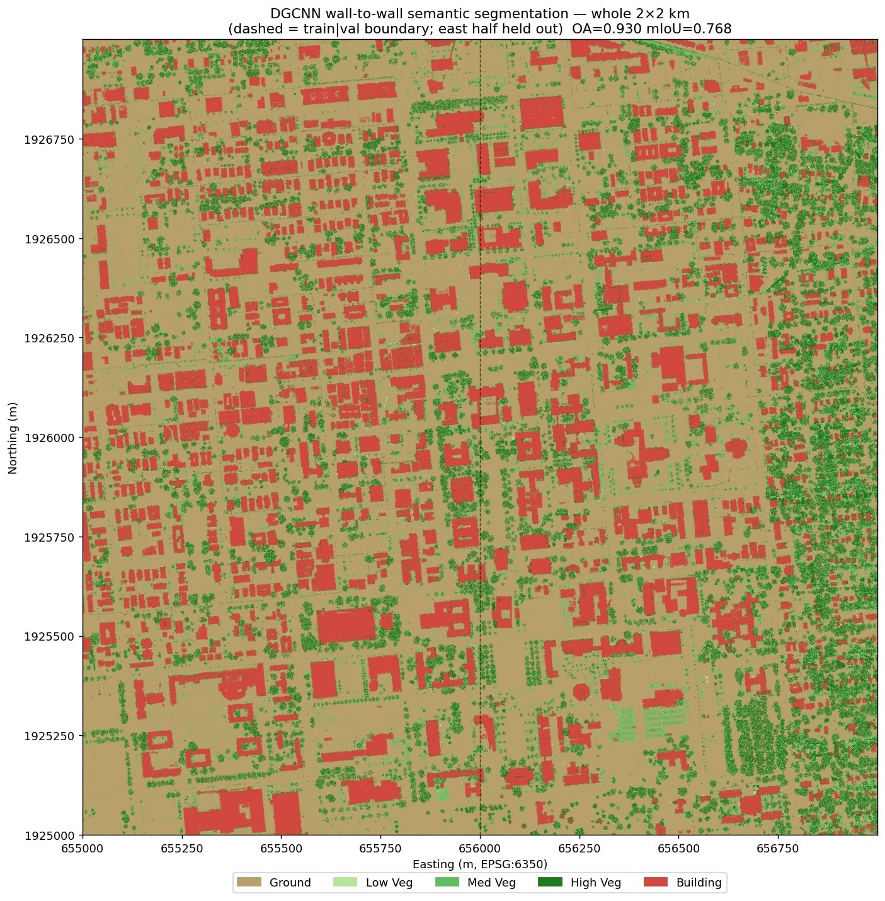</a> |
| **1,312 building instances** (footprint + height) · 11,777 individual trees | **DGCNN** segmentation, OA 0.930 · mIoU 0.768 |

<p align="center"><a href="results/uiuc_campus/naip/naip_segmentation.png">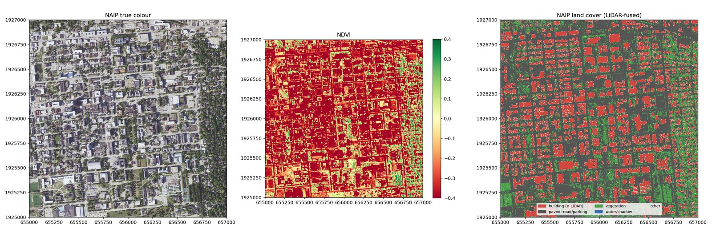</a><br><sub><b>NAIP</b> land cover, LiDAR-fused: the paved layer is the road reference.</sub></p>

</details>

<details open>
<summary><h3>2 · Detecting building omissions (OSM 2019 vs RS consensus)</h3></summary>

LiDAR footprints (corroborated by NAIP) are ground truth; the temporally matched
OSM 2019 `building=*` snapshot is evaluated via IoU matching → completeness →
gridded bias map.

| completeness (count) | completeness (area) | OSM commission | pixel IoU (0.2 m) | Cohen κ |
|---|---|---|---|---|
| **58.3%** | **79.4%** | 29.5% | 0.698 | 0.774 |

OSM captures the large institutional buildings (79% by area) but misses 547 small
structures, and completeness collapses **below 0.3 on the eastern residential
strip**, a sharp bias gradient inside one tile.

**Temporal validation.** Against OSM 2026 the completeness rises to 81.9% / 91.8%:
**the community itself filled 64% of our detected gaps (352/547)**. They were real
omissions, present in the 2019 LiDAR all along. Remote sensing saw in 2019 what took
volunteers seven more years. The 352 confirmations become free ground truth for the
correction stage; the 195 still-unmapped become its deployment targets.

<p align="center"><a href="results/uiuc_campus/comparison/temporal/temporal_evolution.png">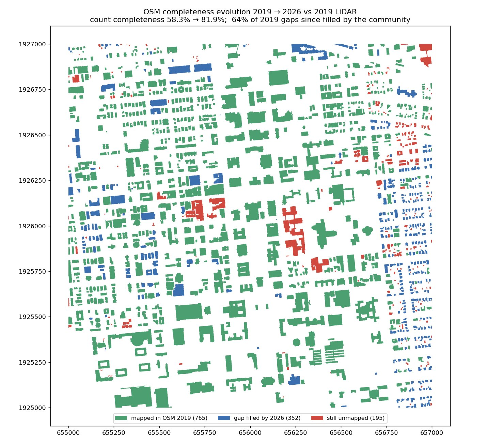</a></p>

</details>

<details>
<summary><h3>3 · Roads (OSM vs the NAIP paved layer)</h3></summary>

91% of OSM 2019 way length has pavement evidence (roads were already well-mapped
where buildings were not) and the vetted major-roads subset is **99.6% supported**;
the all-class shortfall is canopy-shaded footways and steps. The 2019 → 2026 additions
are micro-mapping (+60% segments, +8% length) and **80% of added length was already
paved in 2019**: gap-fill again. Details and caveats:
[results/uiuc_campus/comparison/](results/uiuc_campus/comparison/README.md).

</details>

<details open>
<summary><h3>4 · Statewide scaling: the urban → rural gradient</h3></summary>

The same snapshot scaled to **375,754 major-road segments (235,064 km) across all
102 Illinois counties**, normalized with Census 2019 data.

<p align="center">
<a href="results/statewide_il/choropleth_completeness.png">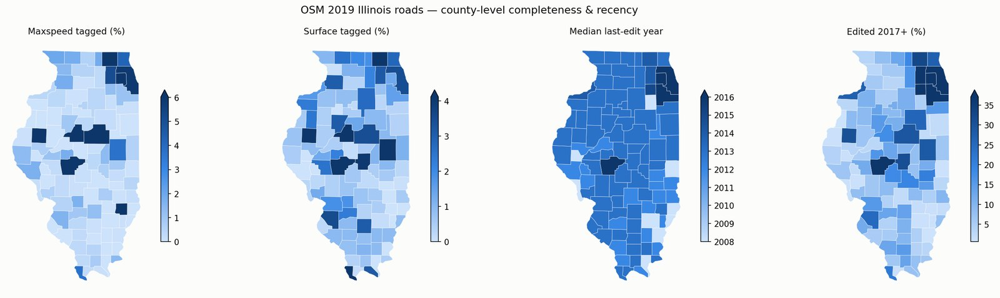</a><br>
<a href="results/statewide_il/scatter_bias.png">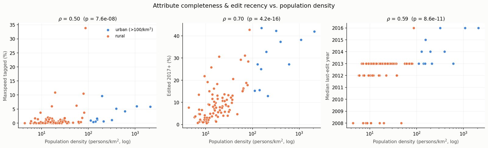</a>
</p>

| metric | ρ vs pop. density | urban mean | rural mean | campus tile |
|---|---|---|---|---|
| % `maxspeed` tagged | **0.50** | 3.1 | 1.2 | **26.0** |
| % `surface` tagged | **0.60** | 2.5 | 1.6 | **37.7** |
| % edited 2017+ | **0.70** | 29.9 | 9.3 | **94.2** |
| road density (km/km²) | **0.71** | 3.60 | 1.31 | — |

<sub>all p < 0.001; urban = ≥ 100 persons/km²</sub>

**(1)** Attribute completeness and edit recency are strongly urban-biased: several
downstate counties have a median last edit of **2008** (untouched since the TIGER
import) while Cook/DuPage/Will sit at 2016 and the campus tile at 2018.
**(2)** Geometric supply is near-complete everywhere (km per 1,000 residents is
*higher* rurally, ρ = −0.97): in the US, **bias lives in attributes and currency,
not in whether the line exists**. **(3)** The gradient is not smooth. Sangamon
County is a single-contributor hotspot (33.9% `maxspeed`, 3–10× any other county).
Write-up: [results/statewide_il/](results/statewide_il/README.md).

</details>

<details open>
<summary><h3>5 · Correcting the bias (propose → score → prioritize)</h3></summary>

Because the community filled 352 of our 547 detections, every machine proposal can be
scored against *what mappers actually drew*, with no manual labels. Three approaches,
west-train / east-eval:

| Approach | Geometry | Confidence | median IoU | AUC | precision@50 |
|---|---|---|---|---|---|
| **A** rules | regularized LiDAR footprint | threshold tiers | 0.677 | 0.742 | 0.62 |
| **B** learned | U-Net (NAIP + CHM) | mask probability | 0.589 | 0.695 | 0.66 |
| **C** hybrid ⭐ | same as A | GBM acceptance scorer | 0.677 | 0.738 | **0.84** |

<p align="center"><a href="results/uiuc_campus/correction/proposal_gallery.png">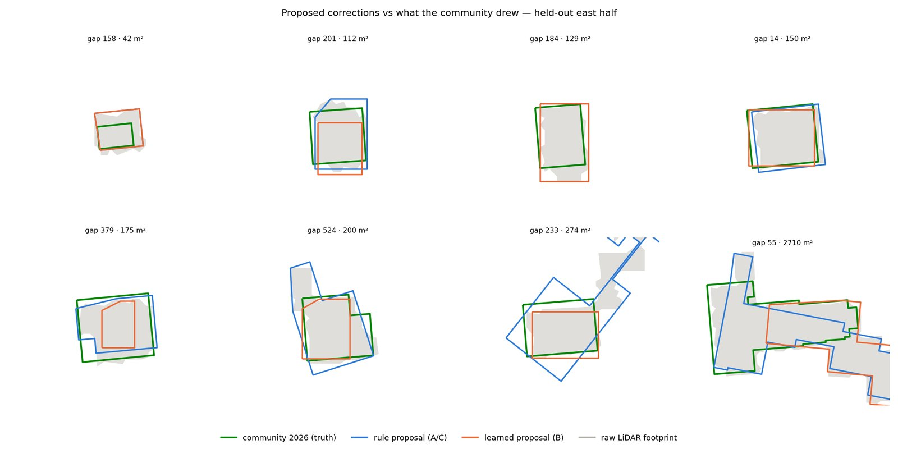</a></p>

With only 83 training gaps, **rules beat learning for geometry** (the raw LiDAR
footprint is itself the best overlap at 0.691; regularization trades a little IoU
for OSM-style right angles). But the **learned scorer wins the human-review queue**:
84% of its top-50 proposals were later confirmed by the community (base rate 65%).
Proposals carry OSM-ready tags (`building=yes`, `height=*`) yet remain research
artifacts per the OSM Automated Edits Code of Conduct: the 195 outstanding proposals
are ranked for human review (`results/uiuc_campus/correction/deployment_map.png`), and a
statewide **staleness × population-exposure** map points the pipeline at Cook, Lake
and Winnebago first (`results/statewide_il/deploy_priority.png`).

</details>

<details open>
<summary><h3>6 · Generalization: the Colorado Springs region</h3></summary>

The whole detect → validate loop repeats on a **2 × 2 km Colorado Springs
residential tile** with deliberately harder inputs: ~5 pts/m² LiDAR carrying only
ground/non-ground classes (no ASPRS building/vegetation), in a semi-arid landscape.
`src/region_detection.py` replaces the missing class evidence with **NAIP NDVI +
the multi-return echo fraction** while keeping the identical grid, morphology and
thresholds: 2,122 buildings detected.

<p align="center"><a href="results/colorado_springs/comparison/temporal/temporal_evolution.png">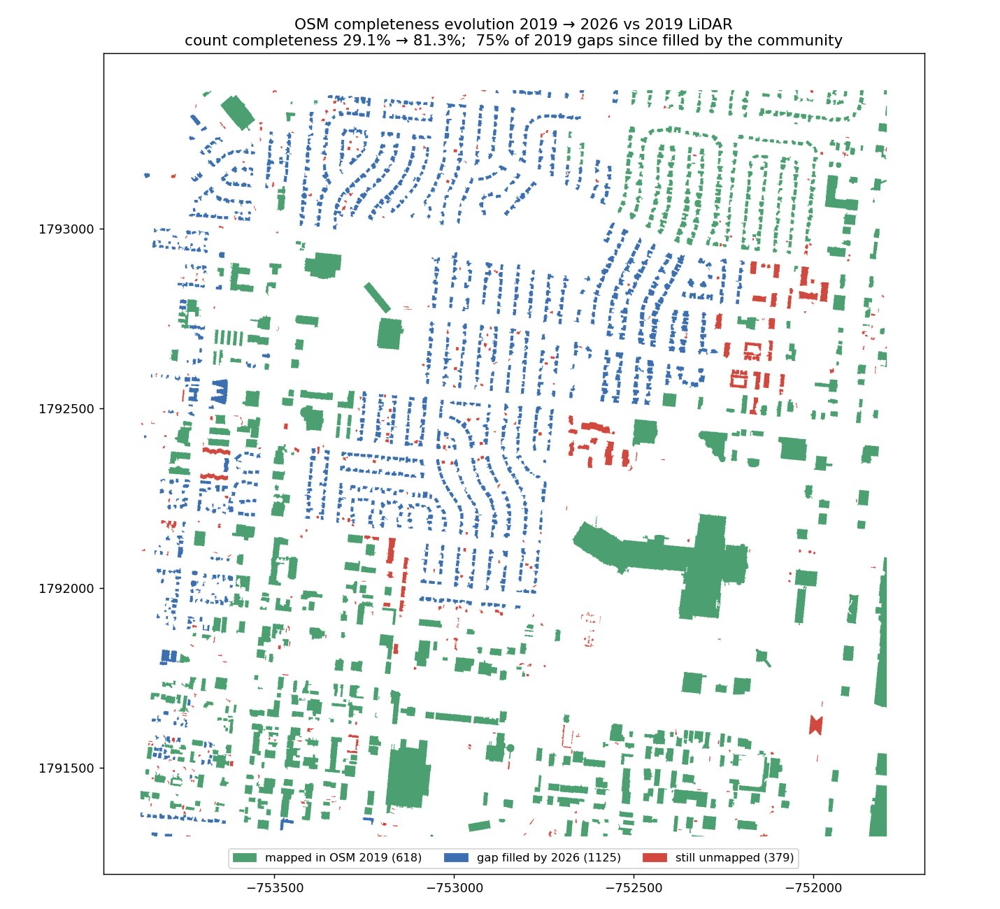</a></p>

| | UIUC campus | Colorado Springs |
|---|---|---|
| OSM 2019 completeness (count / area) | 58.3% / 79.4% | **29.1% / 67.6%** |
| gaps community-filled by 2026 | 64% | **74.8%** |
| completeness today | 81.9% / 91.8% | 81.3% / 91.9% |
| road length NAIP-supported | 99.6% (major) | 99.9% |

The residential tile was under-mapped **twice as badly** as the campus in 2019
(entire subdivisions were absent) and the community has since independently
confirmed three quarters of our detections. Road geometry is near-perfect in both
regions: across two very different landscapes, the bias lives in buildings and
attributes, not the road network. (Semi-arid caveat: dry ground depresses NDVI and
inflates the NAIP impervious class, so the *reverse* explained-paved metric is not
comparable across regions; forward road support is unaffected.)

**Correction transfers too, and the winners flip with label volume.** The same
`propose → score` stage reruns with one region argument; Colorado Springs supplies
821 community-confirmed training gaps (10× the campus) and 304 held-out ones:

| | UIUC campus (83 training gaps) | Colorado Springs (821) |
|---|---|---|
| geometry median IoU | rules **0.677** > U-Net 0.589 | U-Net **0.769** > rules 0.662 |
| confidence AUC / precision@50 | GBM 0.738 / **0.84** | GBM **0.985 / 1.00** |

With scarce labels, regularization rules are the safer geometry; once the community
has confirmed enough examples, the U-Net learns local building style and overtakes
them, and the learned acceptance scorer dominates in both regions (a perfect
top-50 on CS). Practical recipe: *rules first, swap in learning as confirmations
accumulate, always rank the review queue with the learned scorer.* The 379
still-unmapped CS buildings ship as ranked proposals
(`results/colorado_springs/correction/deployment_map.png`).

</details>

## Quick start

```bash
git clone https://github.com/rayford295/vgi-spatial-bias.git && cd vgi-spatial-bias
pip install -r requirements.txt
jupyter lab VGI_Spatial_Bias_Pipeline.ipynb   # end-to-end: downloads all data, runs every stage
```

Device auto-selects CUDA → Apple MPS → CPU; a full campus run takes ≈ 15–25 min
(DGCNN and the correction U-Net are optional flags in the notebook).

<details>
<summary><b>Run the scripts directly</b> (in order; later stages reuse earlier outputs)</summary>

```bash
python src/prepare_data.py           # fetch LiDAR + NAIP + statewide inputs (idempotent)
python src/classical_detection.py    # ground/DTM, buildings, trees   -> results/uiuc_campus/detection/
python src/dgcnn_semseg.py           # semantic segmentation          -> results/uiuc_campus/segmentation/
python src/naip_segmentation.py data/uiuc_campus/NAIP_image.tif            # land cover -> results/uiuc_campus/naip/
python src/vgi_comparison.py data/uiuc_campus/osm_buildings_2019.geojson   # bias map -> results/uiuc_campus/comparison/
python src/statewide_bias.py data/statewide_il/OSM_2019_Major_Roads/gis_osm_roads_2019_IL_Major_Roads.shp \
       data/statewide_il results/statewide_il                        # county gradient
python src/propose_geometry.py && python src/acceptance_scorer.py && \
       python src/propose_learned.py && python src/correction_benchmark.py && \
       python src/deploy_priority.py                           # correction -> results/uiuc_campus/correction/
# second region (Colorado Springs): same pipeline, explicit region paths
python src/prepare_data.py colorado
python src/region_detection.py data/colorado_springs/cs_lidar_2km.laz \
       data/colorado_springs/NAIP_image.tif results/colorado_springs/detection
python src/vgi_comparison.py data/colorado_springs/osm_buildings_2019.geojson \
       results/colorado_springs/comparison results/colorado_springs/detection/buildings.geojson
```

</details>

<details>
<summary><b>Running on the I-GUIDE platform</b></summary>

The notebook's bootstrap cell clones this repository automatically when opened
standalone, and `src/prepare_data.py` fetches all inputs from public storage. Two
platform specifics:

- **Old geospatial stack.** The CyberGISX kernel ships Python 3.8, which caps
  geopandas at ≤ 0.13. The pipeline supports both generations (`union_all` →
  `unary_union` fallback, `read_file(columns=…)` fallback). A geopandas
  `AttributeError`/`TypeError` is almost certainly this version skew; please open
  an issue.
- **Updating an existing clone.** The bootstrap cell clones only when the repo is
  missing; pick up fixes with `!git -C ~/vgi-spatial-bias pull`, then re-run the
  failed cell (every step is idempotent).

</details>

## Repository layout

Everything is organized by study region; `data/` and `results/` mirror each other.

```
VGI_Spatial_Bias_Pipeline.ipynb    end-to-end reproducible notebook (all stages, I-GUIDE-ready)
src/                               pipeline scripts (region-agnostic; defaults = UIUC campus)
  prepare_data.py                    fetch every external input (lidar|naip|statewide|colorado)
  classical_detection.py             UIUC detection (uses ASPRS classes)
  region_detection.py                detection for minimally-classified LiDAR (NDVI+echo)
  dgcnn_semseg.py · pointnet_semseg.py   deep-learning segmentation
  naip_segmentation.py               optical land cover + paved layer
  vgi_comparison.py · pixel_comparison.py · temporal_validation.py    buildings
  road_comparison.py · road_evolution.py · major_roads_analysis.py    roads
  statewide_bias.py                  102-county gradient
  propose_geometry.py · propose_learned.py · acceptance_scorer.py
  correction_benchmark.py · deploy_priority.py                        correction
data/
  uiuc_campus/                     OSM 2019/2026 subsets · metadata · [LiDAR/NAIP, fetched]
  colorado_springs/                boundary · OSM 2019/2026 clips · [LiDAR/NAIP, fetched]
  statewide_il/                    [statewide OSM + Census files, fetched]
docs/                              PROJECT_DESCRIPTION · METHODOLOGY · METRICS · website (index.html) · design specs
results/
  uiuc_campus/                     detection/ · segmentation/ · naip/ · comparison/ · correction/
  colorado_springs/                detection/ · naip/ · comparison/ · correction/
  statewide_il/                    county gradient + deployment priority
```

Bracketed items are heavy inputs: gitignored locally, hosted on the GitHub releases /
I-GUIDE storage, and staged by `python src/prepare_data.py` (idempotent).

Further reading: [PROJECT_DESCRIPTION](docs/PROJECT_DESCRIPTION.md) ·
[METHODOLOGY](docs/METHODOLOGY.md) · [METRICS](docs/METRICS.md).

## Data sources

| Source | What | Where |
|---|---|---|
| **LiDAR** | USGS 3DEP `IL_8County_PlusChampaign_2019_B19` (QL1), EPSG:6350 / NAVD88 | [I-GUIDE storage](https://storage.i-guide.io) · [`campus-rs-2019`](https://github.com/rayford295/vgi-spatial-bias/releases/tag/campus-rs-2019) |
| **NAIP** | 4-band aerial imagery, ~0.7 m | [`campus-rs-2019`](https://github.com/rayford295/vgi-spatial-bias/releases/tag/campus-rs-2019) |
| **OSM 2019** | Illinois statewide extracts (1.20 M buildings, 765 K roads, county-joined major roads) | [`osm-il-2019`](https://github.com/rayford295/vgi-spatial-bias/releases/tag/osm-il-2019) |
| **OSM 2026** | Current snapshots for temporal validation | committed in `data/` |
| **Census 2019** | County land area, population estimates, cartographic boundaries | public census.gov static files |
| **Colorado Springs** | Merged LiDAR (LAZ), clipped + original NAIP, full source bundle incl. statewide CO OSM | [`colorado-springs-2019`](https://github.com/rayford295/vgi-spatial-bias/releases/tag/colorado-springs-2019) |

OSM data © OpenStreetMap contributors, [ODbL](https://www.openstreetmap.org/copyright). USGS 3DEP LiDAR and USDA NAIP are US public domain.

## The team

Team 1 of the [I-GUIDE Summer School 2026](https://i-guide.io/summer-school/summer-school-2026/summer-school-2026-projects/), University of Illinois Urbana-Champaign.

<p align="center">
  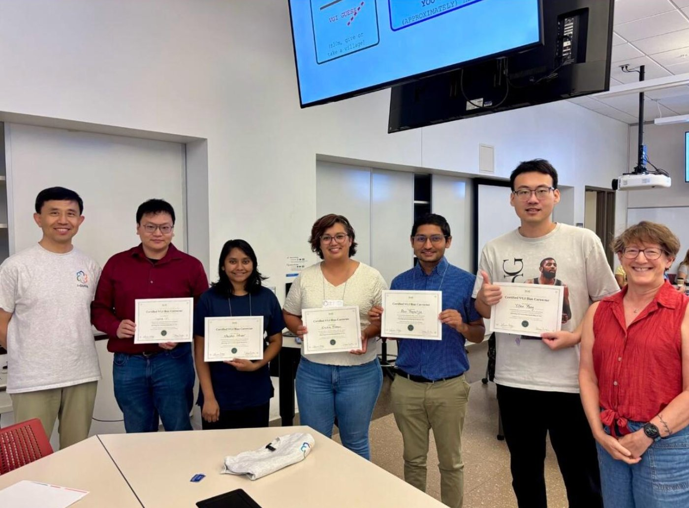<br>
  <sub>The VGI spatial-bias project team.</sub>
</p>

<p align="center">
  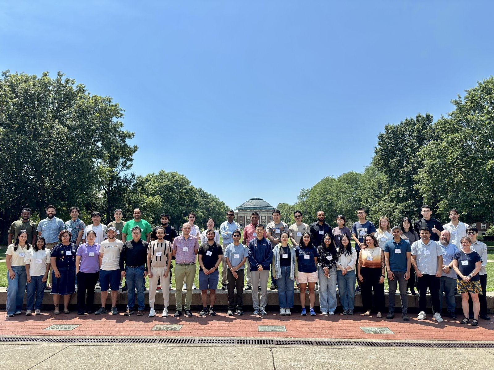<br>
  <sub>I-GUIDE Summer School 2026 cohort, University of Illinois Main Quad.</sub>
</p>

## Citation

If you use this pipeline or its results, please cite the repository (see also [`CITATION.cff`](CITATION.cff)):

```bibtex
@software{vgi_spatial_bias_2026,
  title  = {Detecting and Correcting Spatial Bias in VGI Using Remote Sensing},
  author = {Yang, Yifan and Fillman, Kristina and Nawar, Nowshin and Thapaliya, Ravi and Lyu, Fangzheng},
  year   = {2026},
  url    = {https://github.com/rayford295/vgi-spatial-bias},
  note   = {I-GUIDE Summer School 2026 project; presented at the I-GUIDE VCO, 23 September 2026}
}
```

## License

Code is released under the [MIT License](LICENSE). Input data keep their own terms: USGS 3DEP LiDAR and USDA NAIP are US public domain; OpenStreetMap data is ODbL.
